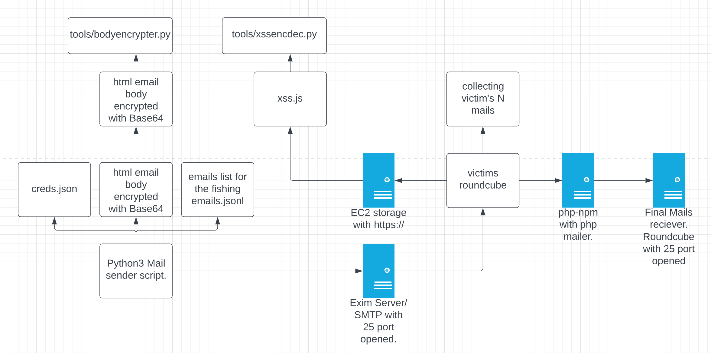

# Base64 email sender with XSS script for Roundcube.

This setup was prepared to deploy as-is on AWS to start email fishiing attack.  
All instruments for encryption/decription and forming files are ain the folder `tools`.   
Haven't mentioned few tools here as they are quite specific for my personal setup.

## Usage: 
`python3 sendmail.py <email.jsonl file> <base64_codded_letter_file>`

**Base64** is critical for achieving the result as every mail platform on rendering stage cuts all `javascripts()`, custom `styles`, etc.

Here is the screenshot with attack structure.

